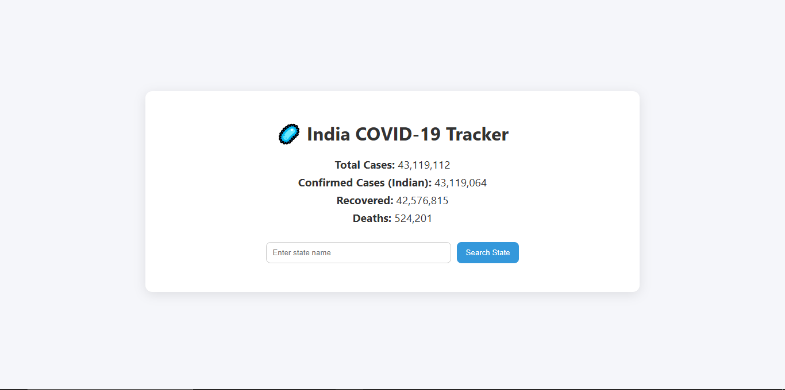
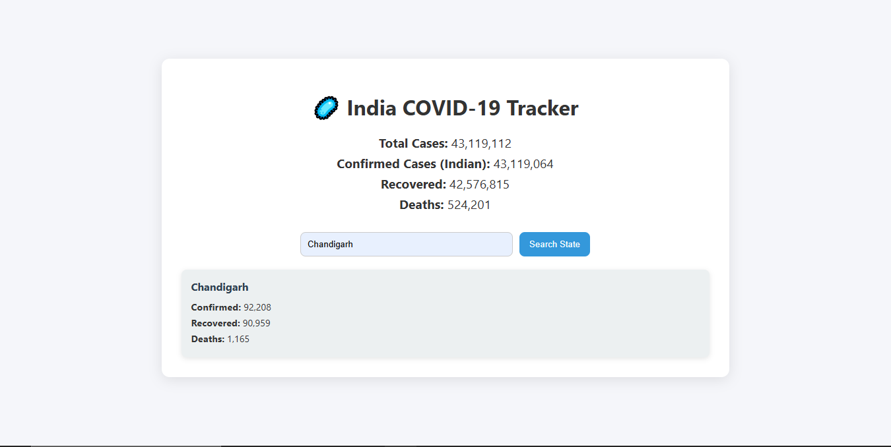

# 🦠 India COVID-19 Tracker

A simple and modern **COVID-19 Tracker** web app built using **HTML, CSS, and JavaScript**.  
It fetches the latest COVID-19 data for India from the [Rootnet API](https://api.rootnet.in/covid19-in/stats/latest).  

---

## 🚀 Features
- ✅ Shows **India-wide COVID-19 stats** (Total, Confirmed, Recovered, Deaths) by default.  
- ✅ Search for any **state** in India to view specific cases.  
- ✅ Clean and **modern UI** with gradient buttons and hover animations.  
- ✅ Responsive layout – works on desktop and mobile.  

---

## 🛠️ Tech Stack
- **HTML5** – Structure  
- **CSS3** – Modern UI styling  
- **JavaScript (ES6)** – API integration & DOM updates  
- **Rootnet COVID-19 API** – [Link](https://api.rootnet.in/covid19-in/stats/latest)  

---

## 📸 Screenshots  

### 🔹 Default India Summary


### 🔹 State Search Example


---

## ⚡ How to Run Locally

1. Clone this repository:
   ```bash
   git clone https://github.com/parmarkrishnaa/Pr_9_Corona-Api.git
   ```

2. Open the project folder:
   ```bash
   cd Pr_9_Corona-Api
   ```

3. Run the app:  
   Just open **index.html** in your browser 🎉  

---

## 🔗 Live Demo
👉 [View Live Project](https://corona-api-ten.vercel.app/)  

---

## 📌 API Reference
- Base URL:  
  ```
  https://api.rootnet.in/covid19-in/stats/latest
  ```
- Provides:
  - **Summary stats** (total cases, confirmed, recovered, deaths)  
  - **State-wise data**  

---

## ✨ Future Improvements
- Add **charts & graphs** (using Chart.js / Recharts)  
- Dark Mode 🌙  
- Auto-refresh every 5 mins  

---

## 👨‍💻 Author
Made with ❤️ by **Krishna Parmar**
